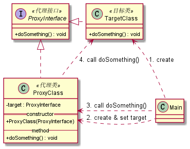
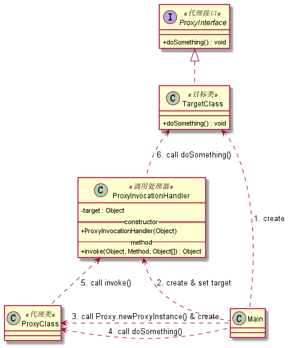
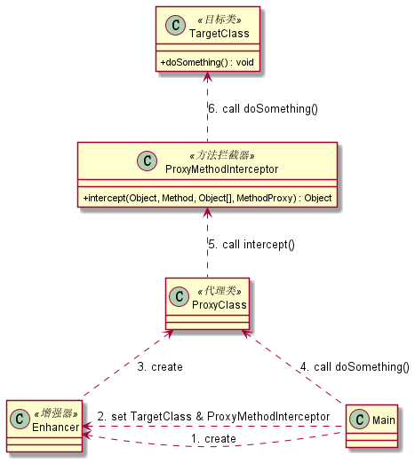

# Java代理

## 目录

- [1. Java代理概念](#1-Java代理概念)
- [2. 项目结构](#2-项目结构)
- [3. 静态代理](#3-静态代理)
  - [3.1 代理过程](#31-代理过程)
  - [3.2 特点](#32-特点)
  - [3.3 优点](#33-优点)
  - [3.4 缺点](#34-缺点)
  - [3.5 示例操作](#35-示例操作)
- [4. jdk动态代理](#4-jdk动态代理)
  - [4.1 代理过程](#41-代理过程)
  - [4.2 生成代理类](#42-生成代理类)
  - [4.3 特点](#43-特点)
  - [4.4 缺点](#44-缺点)
  - [4.5 示例操作](#45-示例操作)
- [5. cglib动态代理](#5-cglib动态代理)
  - [5.1 代理过程](#51-代理过程)
  - [5.2 示例依赖](#52-示例依赖)
  - [5.3 生成代理类](#53-生成代理类)
  - [5.4 特点](#54-特点)
  - [5.5 示例操作](#55-示例操作)

## 1. Java代理概念
Java代理是常用的Java设计模式，通过代理类访问目标类，代理类可为目标类进行信息预处理、过滤、转发、事后处理等操作，以此扩展目标类的功能。

## 2. 项目结构

```
proxy
|—— staticProxy   静态代理
|—— jdkProxy   jdk动态代理
|—— cglibProxy   cglib动态代理
```

## 3. 静态代理
### 3.1 代理过程


### 3.2 特点

- 代理类和目标类共同实现同一个接口，如：`StaticProxyInterface`
- 将目标类传入代理类中，以便代理类调用目标类方法
- 为什么是静态？因为代理类的类型预先定义好了，如：`StaticProxyClass`

### 3.3 优点

- 代理类可以扩展目标类的功能
- 在一定程度上降低系统的耦合度
- (所有代理模式都有这些优点)

### 3.4 缺点

- 因为代理类和目标类需要实现同一个接口，会有很多代理类
- 一旦接口增加方法，代理类和目标类都需要维护

### 3.5 示例操作
执行`StaticProxyMain`的`main()`方法

## 4. jdk动态代理
### 4.1 代理过程


### 4.2 生成代理类

- 在生成代理类之前加上以下代码可输出动态代理产生的类
  ```
  System.getProperties().put("sun.misc.ProxyGenerator.saveGeneratedFiles", "true");
  ```
- 产生的类在`com.sun.proxy`包下
  ```
  // 继承Proxy类，实现JdkProxyInterface接口
  public final class $Proxy0 extends Proxy implements JdkProxyInterface {
      private static Method m0;
      private static Method m1;
      private static Method m2;
      private static Method m3;
  
      public $Proxy0(InvocationHandler param1) {
          super(var1);
      }
  
      // ...省略其它内容...
  
      public final void doSomething() {
          try {
              // h就是传入的invocationHandler参数，
              // 也就是调用JdkProxyInvocationHandler的invoke()方法
              super.h.invoke(this, m3, (Object[])null);
          } catch (RuntimeException | Error var2) {
              throw var2;
          } catch (Throwable var3) {
              throw new UndeclaredThrowableException(var3);
          }
      }
  
      static {
          try {
              m0 = Class.forName("java.lang.Object").getMethod("hashCode");
              m1 = Class.forName("java.lang.Object").getMethod("equals", Class.forName("java.lang.Object"));
              m2 = Class.forName("java.lang.Object").getMethod("toString");
              // 通过反射获取接口方法
              m3 = Class.forName("zam.hzh.proxy.jdkProxy.demo.JdkProxyInterface").getMethod("doSomething");
          } catch (NoSuchMethodException var2) {
              throw new NoSuchMethodError(var2.getMessage());
          } catch (ClassNotFoundException var3) {
              throw new NoClassDefFoundError(var3.getMessage());
          }
      }
  }
  ```

### 4.3 特点

- 目标类实现接口
- 实现`InvocationHandler`接口创建调用处理器，将目标类传入调用处理器中以便通过反射调用目标类方法
- 为`Proxy`类指定ClassLoader对象、一组interfaces以及调用处理器来创建动态代理类
- 通过动态代理类执行方法实现代理

### 4.4 缺点

- 目标类需要直接或间接实现接口

### 4.5 示例操作
执行`JdkProxyMain`的`main()`方法

## 5. cglib动态代理
### 5.1 代理过程


### 5.2 示例依赖

```
<!-- 导入cglib依赖 -->
<dependency>
    <groupId>cglib</groupId>
    <artifactId>cglib</artifactId>
    <version>3.3.0</version>
</dependency>
```

### 5.3 生成代理类

- 在生成代理类之前加上以下代码指定输出动态代理产生的类的路径

   ```
    System.setProperty(DebuggingClassWriter.DEBUG_LOCATION_PROPERTY, System.getProperty("user.dir") + File.separator + "com");
   ```

- 产生的类在`com.zam.hzh.proxy.cglibProxy.demo`包下

   ```
    // 继承CglibTargetClass类
    public class CglibTargetClass$$EnhancerByCGLIB$$8f88cc11 extends CglibTargetClass implements Factory {
        private boolean CGLIB$BOUND;
        public static Object CGLIB$FACTORY_DATA;
        private static final ThreadLocal CGLIB$THREAD_CALLBACKS;
        private static final Callback[] CGLIB$STATIC_CALLBACKS;
        private MethodInterceptor CGLIB$CALLBACK_0;
        private static Object CGLIB$CALLBACK_FILTER;
        private static final Method CGLIB$doSomething$0$Method;
        private static final MethodProxy CGLIB$doSomething$0$Proxy;
        private static final Object[] CGLIB$emptyArgs;
        private static final Method CGLIB$equals$1$Method;
        private static final MethodProxy CGLIB$equals$1$Proxy;
        private static final Method CGLIB$toString$2$Method;
        private static final MethodProxy CGLIB$toString$2$Proxy;
        private static final Method CGLIB$hashCode$3$Method;
        private static final MethodProxy CGLIB$hashCode$3$Proxy;
        private static final Method CGLIB$clone$4$Method;
        private static final MethodProxy CGLIB$clone$4$Proxy;
    
        static void CGLIB$STATICHOOK1() {
            CGLIB$THREAD_CALLBACKS = new ThreadLocal();
            CGLIB$emptyArgs = new Object[0];
            Class var0 = Class.forName("zam.hzh.proxy.cglibProxy.demo.CglibTargetClass$$EnhancerByCGLIB$$8f88cc11");
            Class var1;
            Method[] var10000 = ReflectUtils.findMethods(new String[]{"equals", "(Ljava/lang/Object;)Z", "toString", "()Ljava/lang/String;", "hashCode", "()I", "clone", "()Ljava/lang/Object;"}, (var1 = Class.forName("java.lang.Object")).getDeclaredMethods());
            CGLIB$equals$1$Method = var10000[0];
            CGLIB$equals$1$Proxy = MethodProxy.create(var1, var0, "(Ljava/lang/Object;)Z", "equals", "CGLIB$equals$1");
            CGLIB$toString$2$Method = var10000[1];
            CGLIB$toString$2$Proxy = MethodProxy.create(var1, var0, "()Ljava/lang/String;", "toString", "CGLIB$toString$2");
            CGLIB$hashCode$3$Method = var10000[2];
            CGLIB$hashCode$3$Proxy = MethodProxy.create(var1, var0, "()I", "hashCode", "CGLIB$hashCode$3");
            CGLIB$clone$4$Method = var10000[3];
            CGLIB$clone$4$Proxy = MethodProxy.create(var1, var0, "()Ljava/lang/Object;", "clone", "CGLIB$clone$4");
            CGLIB$doSomething$0$Method = ReflectUtils.findMethods(new String[]{"doSomething", "()V"}, (var1 = Class.forName("zam.hzh.proxy.cglibProxy.demo.CglibTargetClass")).getDeclaredMethods())[0];
            CGLIB$doSomething$0$Proxy = MethodProxy.create(var1, var0, "()V", "doSomething", "CGLIB$doSomething$0");
        }
    
        final void CGLIB$doSomething$0() {
            super.doSomething();
        }
    
        public final void doSomething() {
            MethodInterceptor var10000 = this.CGLIB$CALLBACK_0;
            if (var10000 == null) {
                CGLIB$BIND_CALLBACKS(this);
                var10000 = this.CGLIB$CALLBACK_0;
            }
    
            if (var10000 != null) {
                // var10000就是设置的回调函数，
                // 也就是调用CglibProxyInterceptor的intercept()方法
                var10000.intercept(this, CGLIB$doSomething$0$Method, CGLIB$emptyArgs, CGLIB$doSomething$0$Proxy);
            } else {
                super.doSomething();
            }
        }
   
        // ...省略其它内容...
    
        static {
            CGLIB$STATICHOOK1();
        }
    }
   ```

### 5.4 特点

- 目标类无需实现接口
- 实现`MethodInterceptor`接口创建方法拦截器（回调函数）
- 定义`Enhancer`并配置目标类及回调函数，调用`create()`方法创建代理类
- 通过代理类执行方法实现代理
- 生成的代理类是目标类的子类，重写了目标类的方法

### 5.5 示例操作
执行`CglibProxyMain`的`main()`方法
